<div align="center">
  
<!-- PLACEHOLDER FOR LOGO -->


# Troves - Kotlin Multiplatform eCommerce

**Troves** is a modern, cross-platform eCommerce application built using **Kotlin Multiplatform (KMP)** and **Compose Multiplatform**. It delivers a seamless, native-like shopping experience on both Android and iOS from a single shared codebase.

</div>

---

## ✨ Key Features

- **Product Catalog & Management:** Browse products, categories, and brands powered by the **Shopify API** via **Apollo GraphQL**.
- **AI Shopping Assistant:** An intelligent chat feature powered by **Google Gemini** (with a Cloudflare backend) to assist users with their shopping experience.
- **Cart & Checkout Flow:** A complete shopping cart and checkout process.
- **Versatile Payment Options:** 
  - Integrated with **Paymob** for both iOS and Android, utilizing **Supabase Edge Functions / Webhooks** to orchestrate the payment flow and seamlessly create the corresponding **Shopify** order.
  - Supports **Shopify Payment Sheet Kit** across platforms.
  - Cash on Delivery (COD) available.
- **Location Services:** Integrated **Mapbox** for precise delivery address selection with automatic camera animation to user location.
- **User Profiles:** Manage addresses, favorites, and view order history.
- **Authentication:** Secure user onboarding and login flow via **Firebase Auth**.
- **Multi-Platform UI:** 100% shared UI using Jetpack Compose Multiplatform.

---

## 📸 Screenshots

<div align="center">
  <table>
    <tr>
      <td>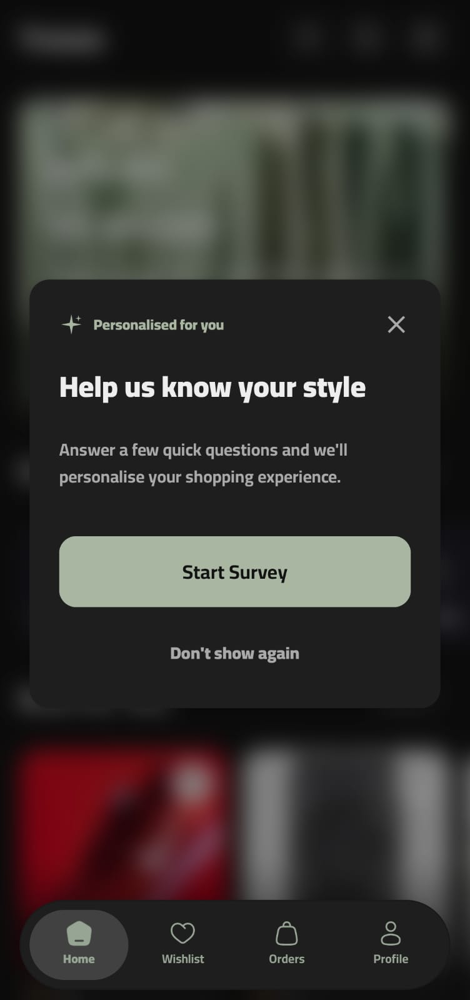</td>
      <td>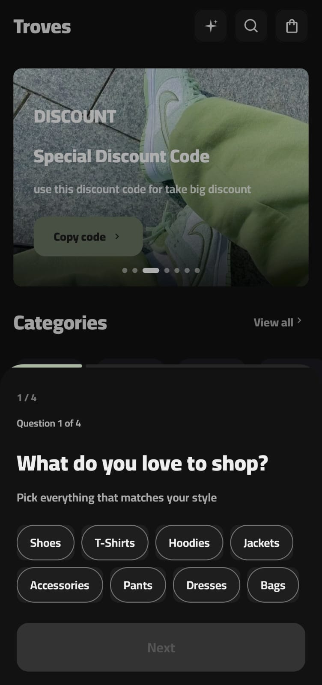</td>
      <td>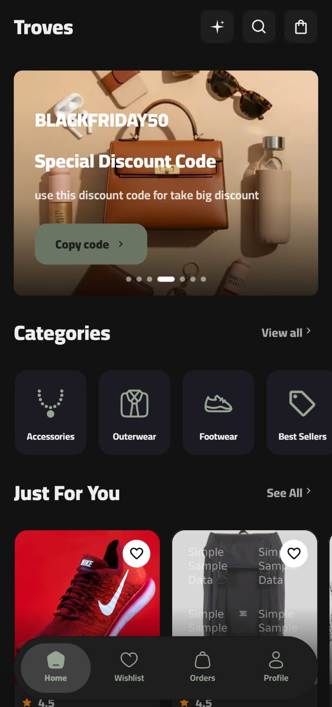</td>
      <td>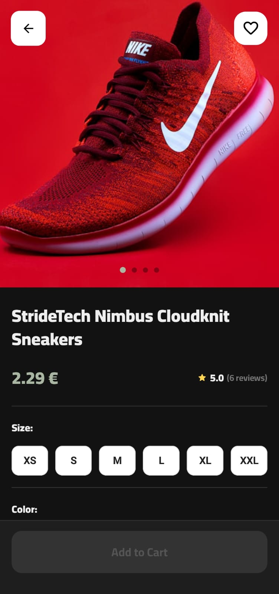</td>
    </tr>
    <tr>
      <td>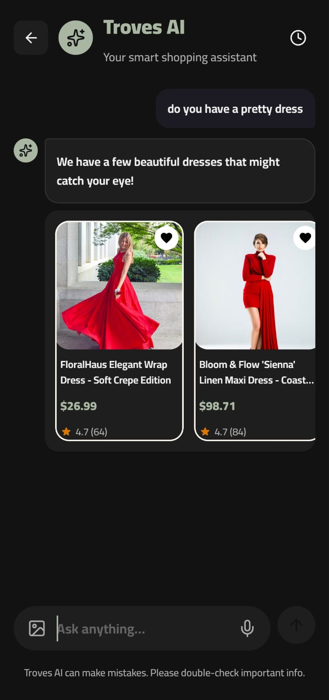</td>
      <td>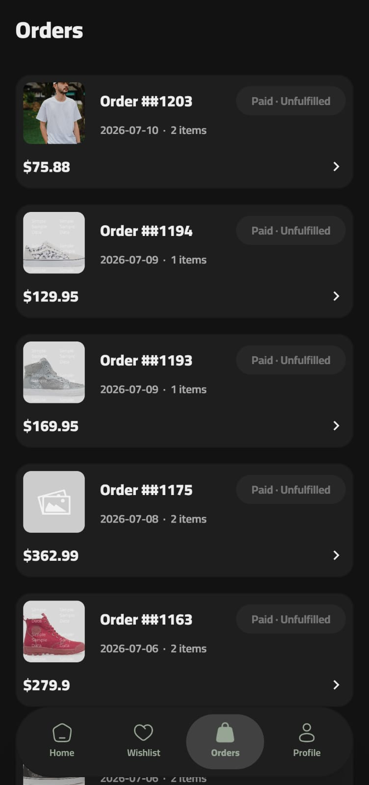</td>
      <td>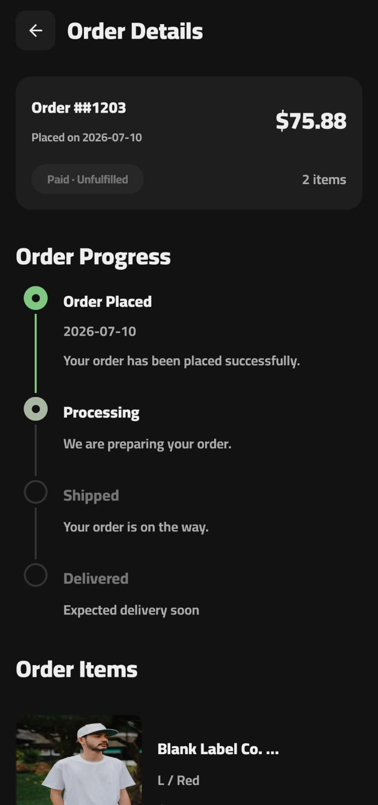</td>
      <td>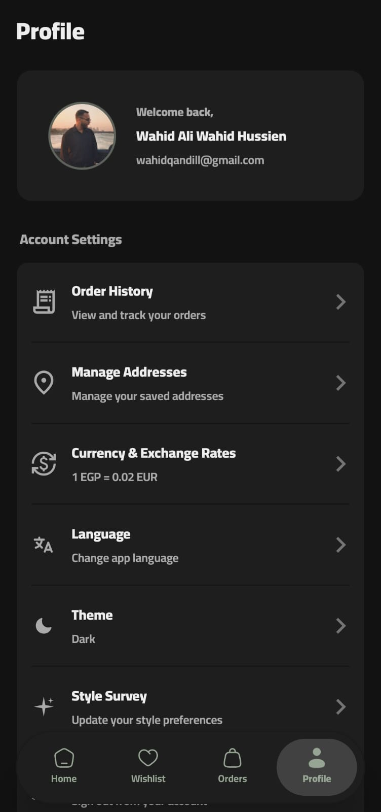</td>
    </tr>
    <tr>
      <td>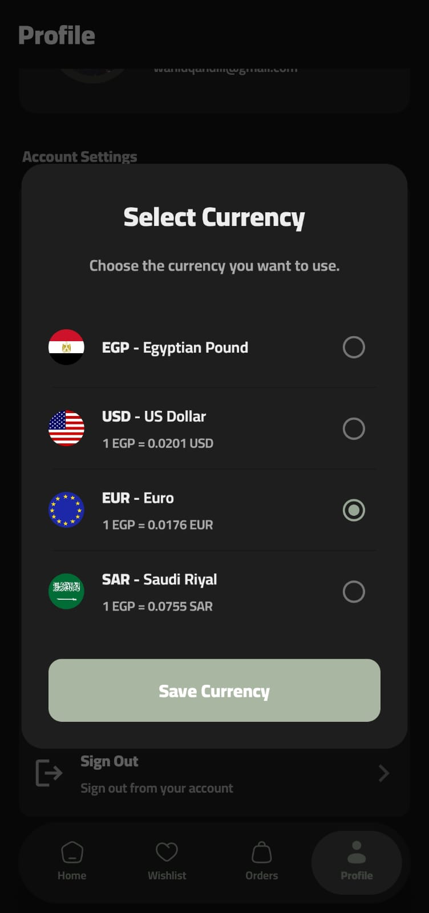</td>
      <td>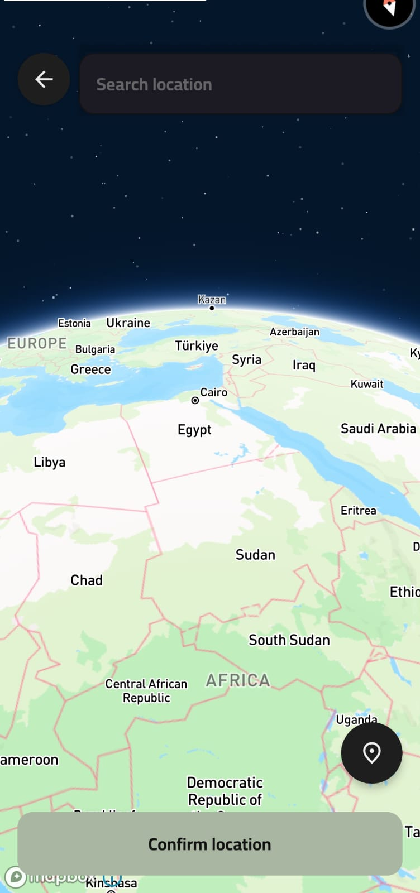</td>
      <td>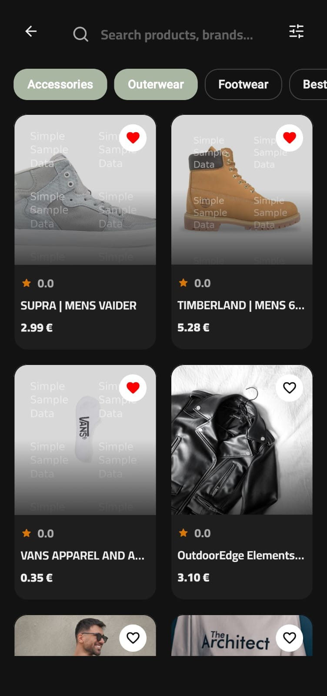</td>
      <td></td>
    </tr>
  </table>
</div>

---

## 🏗 Architecture

Troves follows **Clean Architecture** principles and is structured as a **Multi-Module Project** to ensure scalability, separation of concerns, and maintainability:

- **`domain`**: Contains the core business logic, entities, and use cases.
- **`data`**: Handles data operations, repositories, and API/Database integrations.
- **`presintation`**: (Presentation) Contains the UI logic, ViewModels, and navigation components.
- **`designSystem`**: A dedicated module for reusable UI components, themes, and styling.
- **`shared`**: The central KMP module that wires up the application logic for both platforms.
- **`androidApp`**: The Android entry point.
- **`iosApp`**: The iOS entry point (consumed as a framework).

---

## 🛠 Tech Stack

- **Framework:** [Kotlin Multiplatform (KMP)](https://kotlinlang.org/docs/multiplatform.html)
- **UI Toolkit:** [Compose Multiplatform](https://www.jetbrains.com/lp/compose-multiplatform/)
- **Navigation:** [AndroidX Navigation3](https://developer.android.com/guide/navigation/navigation-multiplatform) (Experimental)
- **Dependency Injection:** [Koin](https://insert-koin.io/)
- **Networking:** [Apollo GraphQL](https://www.apollographql.com/docs/kotlin/) & [Ktor Client](https://ktor.io/)
- **Local Storage:** [Room (SQLite)](https://developer.android.com/training/data-storage/room) & [DataStore](https://developer.android.com/topic/libraries/architecture/datastore)
- **Image Loading:** [Coil 3](https://coil-kt.github.io/coil/)
- **Maps:** [Mapbox SDK](https://www.mapbox.com/)
- **Logging:** [Kermit](https://github.com/touchlab/Kermit)
- **Payments:** Paymob SDK & Shopify Payment Sheet Kit
- **Third-Party Integrations:** GitLive Firebase KMP SDK, Supabase Edge Functions / Webhooks

---

## 🚀 Getting Started

### Prerequisites
- [Android Studio](https://developer.android.com/studio) (latest version recommended)
- [Xcode](https://developer.apple.com/xcode/) (for running the iOS app)
- Kotlin Multiplatform Mobile plugin installed in Android Studio

### Running the Apps

You can use the run configurations provided by the run widget in Android Studio's toolbar, or use the following commands:

**Android App:**
```bash
./gradlew :androidApp:assembleDebug
```
*Or simply run the `androidApp` configuration in Android Studio.*

**iOS App:**
Open the `iosApp` directory in Xcode and run it from there, or use the `iosApp` run configuration in Android Studio.

### Running Tests

Use the run button in your IDE's editor gutter, or run tests using Gradle tasks:

- **Android tests:** `./gradlew :shared:testAndroidHostTest`
- **iOS tests:** `./gradlew :shared:iosSimulatorArm64Test`

---

## 📄 License